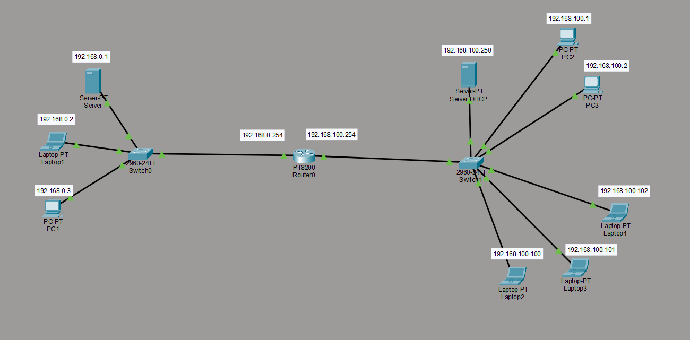

# TCP/IP Network – Cisco Packet Tracer

This repository contains a TCP/IP network project created with **Cisco Packet Tracer**
as part of the OpenClassrooms course *“Design your TCP/IP network”*, in preparation for a
**BTS SIO (SISR option)**.

## Project goal
Design and configure a simple network composed of two different IP subnets, connected
through a router, with basic network services.

## Network architecture
- Two IP networks:
  - 192.168.0.0/24
  - 192.168.100.0/24
- One router providing routing between the two networks
- Two switches
- Multiple client machines (PCs and laptops)
- One DHCP / DNS server

## Implemented services
- **DHCP**: automatic IP address assignment for client devices
- **DNS**: basic name resolution
- **Routing**: communication between both networks via the router

## Network diagram

## Tool used
- Cisco Packet Tracer
